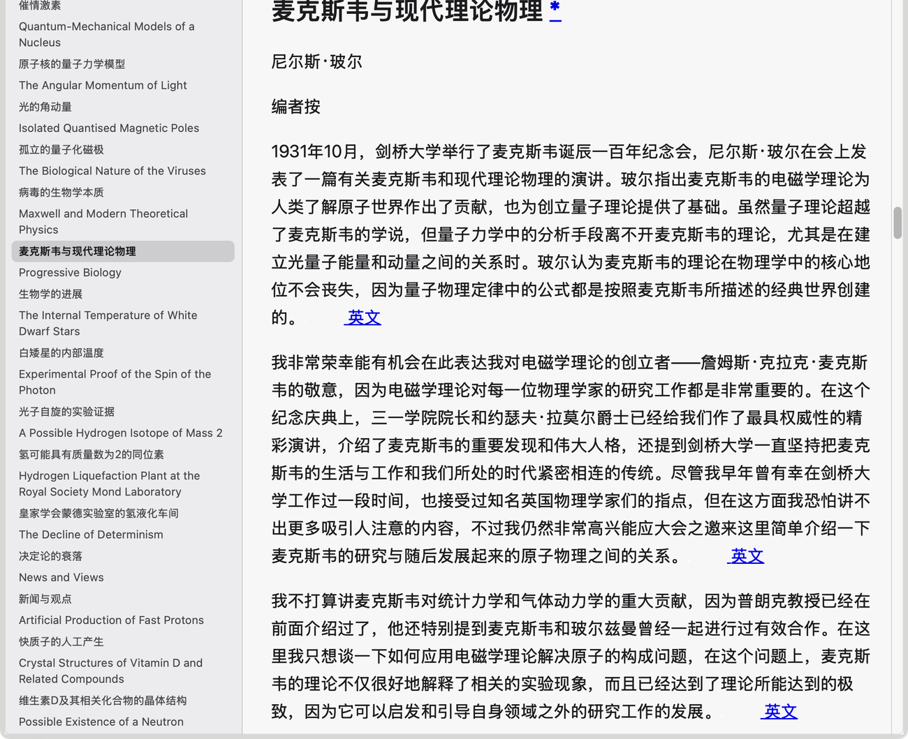

# EBookQL

Quick Look previews **and thumbnails** for EPUB, MOBI, AZW, AZW3, FictionBook, DjVu, CBZ and
CHM
books, and for Markdown, on macOS. Select a book or a note in the Finder, press **Space**,
read it.


One reader UI over seven parsers (an EPUB one, a libmobi-backed MOBI one, a FictionBook one, a
DjVu one, a CBZ one, a CHM one, and a JavaScriptCore + `marked` Markdown one), so every format looks and
behaves the same: the same sidebar, the same controls, the same reading position, the same
thumbnail card. Markdown brings its own math and diagrams, and DjVu its own page decoder —
both rendered entirely offline.

## What you get

- **Quick Look preview** — a full window in the Finder's Quick Look panel: the book's own
  text (or, for a scan or a comic, its pages) in a readable column, its images, and a covering
  page instead of a blank panel.
- **Markdown, with math and diagrams** — `.md`, `.markdown` and `.mdx` render as GFM.
  Inline and display LaTeX become real math via KaTeX, fenced `mermaid` blocks become
  diagrams, and heading ids keep `[text](#heading)` links working. Both libraries are
  bundled, so nothing is fetched from the network.
- **FictionBook** — `.fb2` opens with its base64 images inline. A book whose chapter titles
  were dropped by whatever converted it still gets a sidebar: the contents are read back out
  of the file's own section structure and headings, and the sidebar says at the top that they
  were guessed rather than passing them off as the book's own table of contents.
- **Table of contents** — a folding tree in the sidebar, which opens as a plain outline. The
  entry you are reading is highlighted as you scroll, its branch unfolds itself so the
  highlight is never hidden, and the sidebar follows to keep it in view. The branch you have
  left closes behind you — unless you switch that off with the toggle beside *fold all*, and
  then the tree only ever opens. Click to jump; the book's own internal links work too.
- **Picks the richer table of contents** — some books declare a good one in their container
  and some only mark up headings, so both are read and the one with more entries wins.
- **Reading position** — the panel comes back to where you stopped, per book, in a small
  SQLite file, with a "Resumed at NN%" pill that can send you back to the top.
- **Text size** — A− / 100% / A+ in the sidebar header, or ⌘ + two-finger scroll anywhere in
  the panel. Holding a button keeps stepping, because Quick Look opens the file in its
  default app on a double-click anywhere in the panel, so two quick clicks are not an
  option. Only the book's text scales: the sidebar, the images and the panel keep their size.
  A page-image book — a DjVu scan, a CBZ comic — has no text to scale, so there the same
  control sizes the **page**.
- **Resizable sidebar** — drag the divider; the width is remembered. It stops at the width
  its own header row still fits in, rather than squeezing the controls.
- **See where a link leads** — hover a link or an image and its real target appears in a
  strip at the foot of the page, the way a browser does. An in-page link names the entry it
  jumps to; an image shows its URL.
- **Thumbnails** — the Finder shows a card built from the book's own title, author and
  opening lines rather than a generic icon.
- **A configuration window** — the app itself is a settings window, in three tabs. *General*
  switches the two Markdown extensions on or off and reports what this Mac has actually
  registered, with the system's own extension pane one button away. *Markdown* holds the
  rendering choices: JavaScript or plain source, line numbers, System/Light/Dark, and
  whether Markdown previews may load remote images. *FB2* holds the one FictionBook choice:
  whether a book whose chapter titles are missing may have its contents guessed from its text.
- **Large books stay responsive** — the book is one page, so sections below the fold are
  not laid out until they are needed. (A page-image book is laid out in full on purpose:
  every page's height is known from its own shape, which is what makes the scrollbar and the
  reading position exact before anything has loaded.)
- **No network by default** — the extensions are sandboxed, and the custom scheme only ever
  serves the book being previewed plus the extension's own bundled rendering assets. A
  remote (http/https) image is not fetched: in Markdown it is replaced by a placeholder
  naming its host unless you allow network images in the app's Markdown tab, and no book
  format — EPUB, MOBI, FictionBook, DjVu, CBZ — ever loads one.

## Install

### From the disk image

1. Open `EBookQL-<version>.dmg`.
2. Drag **EBookQL** onto the **Applications** folder in that window.
3. **Open EBookQL once.** That is what registers its four extensions: copying the app by
   itself registers nothing. The window reports whether they are live, carries the
   Markdown settings, and re-registers everything on request.

Then select a book or a Markdown file in the Finder and press Space.

If the window says an extension is *switched off*, turn it on in
**System Settings ▸ General ▸ Login Items & Extensions ▸ Quick Look**, then reopen the
Finder. EBookQL will not switch an extension back on behind your back.

### From source

```sh
brew install xcodegen
./install.sh              # build, install into /Applications, register all four extensions
./install.sh status       # what is registered, and how the book UTIs resolve
./install.sh history      # the reading-position database
./install.sh uninstall
```

`install.sh` builds Release and signs everything "Sign to Run Locally", so no Apple
developer account is needed. If `xcode-select` points at the Command Line Tools, the
script points `DEVELOPER_DIR` at Xcode itself.

## Formats

| Format | Read by | Notes |
|---|---|---|
| `.epub` | the project's own ZIP + OPF/NCX reader | zipped `.epub` |
| `.fb2` | the project's own XML reader | FictionBook with its base64 images; contents are derived from the book's own sections and headings (see [FictionBook](#fictionbook)) |
| `.djvu`, `.djv` | the project's own container reader + a vendored JavaScript page decoder | scanned pages; the file's own outline becomes the sidebar (see [DjVu](#djvu)) |
| `.chm` | the project's own ITSF container reader + an LZX decompressor | Microsoft HTML Help: one section per topic page, contents derived from the page titles (see [CHM](#chm)) |
| `.cbz` | the project's own ZIP reader + the web view's own image loading | a ZIP of page images; its `ComicInfo.xml` supplies the title and any bookmarks (see [CBZ](#cbz)) |
| `.mobi`, `.azw`, `.azw3` | [libmobi](https://github.com/bfabiszewski/libmobi), vendored | KF7 and KF8; images and the container's NCX table of contents are read from the file |
| `.md`, `.markdown`, `.mdx` | JavaScriptCore + embedded [marked](https://github.com/markedjs/marked) | GFM; front matter supplies title/author; LaTeX math and mermaid diagrams render offline |

The MOBI family, FictionBook, DjVu, CBZ and CHM have no system-declared UTI, so the app exports one
for each (`.djvu` is `com.rocaltair.djvu`, `.cbz` is `com.rocaltair.cbz`); the extensions also
declare the UTIs other readers export, because which declaration wins is not under the
extension's control. `.md` and `.markdown` use the system's own `net.daringfireball.markdown`
type, and `.mdx` is EBookQL's own type conforming to it.

## Markdown

`.md`, `.markdown` and `.mdx` get the same reader as books. GitHub-flavored Markdown is
parsed by an embedded copy of `marked`, and the sidebar is derived from the headings it
generates, so `[text](#heading)` links keep working. Inline and display LaTeX (`$…$`,
`$$…$$`, `\(…\)`, `\[…\]`) is typeset with KaTeX, and fenced `mermaid` blocks become
diagrams. Both libraries are vendored and served through the extension's own scheme, so
math and diagrams work with no network at all.

The app window is where Markdown is configured, in its Markdown tab: render with JavaScript
or show the raw source, line numbers, System/Light/Dark, and whether a remote
http/https image may be loaded. Network images are off by default — until you turn them on, a
remote image appears as a placeholder naming its host. The settings travel from the
unsandboxed app into the sandboxed extensions through a small JSON file, written into each
extension's own container: the Markdown extension reads all of it, and the book extension
reads its one FictionBook key. No book format reads any of them, and none of them loads a
remote image.

With JavaScript rendering off, a file is shown as escaped source instead, which is handy for
inspecting the markup; math and diagrams then appear as their source text.

## FictionBook

`.fb2` files are XML with their images embedded as base64, so a preview is the file itself —
no archive and no side files. Their contents come from the book's own sections and headings.

Most `.fb2` files in the wild were converted from something else, and the converters drop
every `<title>` element — which is what a FictionBook table of contents is made of. Those
books still carry their `<section>` structure, and a section normally opens with its own
chapter title as an ordinary paragraph, so the preview reads that structure back:

- a section's first paragraph is that section's title, at the level its `<title>` would have
  had — so a chapter and the subheadings under it nest the way the book does;
- a paragraph that names its own level ("Part II …", "Chapter 4 …", "Appendix", "Глава 1")
  is a heading at that level;
- failing both, a paragraph that is nothing but one bold line counts as a subheading.

The app's **FB2** tab turns this off (*Guess the contents from the text*, on by default).
While it is on, a book whose contents were guessed says so at the top of the sidebar —
*"Contents guessed from the text — this file has no chapter titles of its own."* A book that
has titles of its own is never guessed at, whatever the setting says.

## DjVu

`.djvu` and `.djv` are scanned pages, not text — so this is the one format whose preview
renders page images rather than markup. The reader reads the container (the multi-page
directory, the document's own outline, page sizes, metadata) and hands each page's bytes to a
page decoder bundled with the preview; the pages are never decoded in Swift, and they are
served one at a time, so opening a 200-page scan does not put the whole book in memory.

- A file with a **document outline** (DjVu's `NAVM` bookmarks) shows it as the sidebar, with
  the nesting the file declares.
- A file **without one** lists its pages instead — and says so in the sidebar, because page
  numbers are not the book's table of contents.
- Pages are decoded as you approach them (~75-150 ms for a 600 dpi bilevel page) and the
  decoded canvases are released as you move past them. **A− / A+ size the page**, not the text.
- The page keeps its exact shape from the moment the preview opens, so the scrollbar and the
  reading position are right before any page has been decoded — and the position is remembered
  per page.

DjVu is decoded with DejaView (MIT), vendored under `EBookQLPreview/DjVuAssets/`. DjVuLibre
would have been the obvious native choice, but it is GPLv2 and this project is MIT.

## CHM

`.chm` (Microsoft HTML Help) is the one format whose Quick Look extensions ship **switched off** -
the box in the app's window registers or unregisters them, the same way the Markdown switch works.
It arrives last, it is the least-tested parser here, and turning it on is the reader's call.

The container is read in Swift: the ITSF directory, then the LZX-compressed section, one page at a
time. Pages are ordinary HTML, so a CHM renders through the same reader as an EPUB - one section per
topic, cross-topic links resolved to in-page anchors, images and CSS served over `ekbres://chm/…`.

Two things a `.chm` does not give you for free:

- **Its contents.** A help file usually carries a `.hhc` tree; the one in this project's test corpus
  does not, and the compiled "automatically generated" form is a binary structure no reader parses
  (`chmlib` and 7-Zip both skip it). The sidebar is then built from the pages' own titles, grouped by
  folder, and says so in a note above the list - a derived list must never pass itself off as the
  book's own table of contents.
- **Its encoding.** Topics are ANSI in whatever code page the compiler was given, so the page's own
  `<meta charset>` is tried first, anything Chinese is decoded as GB18030 (files that *say* `gb2312`
  are routinely GB18030 bytes), then Foundation's detector, then Latin-1 so a stray file stays
  readable.

## CBZ

A `.cbz` is a ZIP archive of page images — the comic convention — so its preview is the
simplest of the lot: each page is an `` loaded from the archive as you reach it, one
decompression at a time, with the page's shape reserved from its own image header before the
picture arrives.

- A comic with a **`ComicInfo.xml`** shows what the manifest says: the title (series and
  number), the writer, and its per-page **bookmarks** as the sidebar's contents.
- A comic **without one** lists its pages, taking the archive's own page names, and sorts them
  the way a person reads (`page9` before `page10`). A comic whose pages sit in chapter folders
  is listed one level deeper, because a flat list of 600 pages named `001` to `050` sixteen
  times over is not navigation. As in DjVu, a page list says so in the sidebar.
- **A− / A+ size the page**, and the reading position is remembered per page.
- `.cbr` (RAR) and `.cbt` (TAR) are not claimed: only a ZIP is read.

## Requirements

- macOS 14.0 or later. Developed and tested on macOS 15.8 with Xcode 16.4.
- Universal: Apple silicon and Intel.
- Building from source needs Xcode and [xcodegen](https://github.com/yonaskolb/XcodeGen);
  `project.yml` is the source of truth and the `.xcodeproj` is generated.

## While reading



The chapter you are reading is highlighted in the table of contents as you scroll, and the
part it lives in unfolds itself so that entry stays in view; the toggle beside *fold all*
stops the tree closing anything behind you, if you would rather it only ever open. Hovering a
link or an image names its target in a strip at the foot of the page. In a bilingual edition
the book's own cross-links (here 英文 / 中文) work as well.

## Known limitations

- **Very large MOBI bodies are cut at 8 MB of text.** Reference works can go past that; the
  preview says `Truncated preview: showing the first N MB of M MB`, and the entries beyond
  the cut stay in the sidebar as plain text rather than links. The alternative is a long
  first paint on every open.
- **Some Calibre conversions name anchors that were never created.** Those entries land at
  the top of their chapter instead of at a heading inside it.
- **A downloaded copy is quarantined.** The app is ad-hoc signed and not notarized, so a
  copy that arrives over the network will not open until you right-click it and choose
  Open. A disk image handed over locally has no such flag.
- **Markdown math and diagrams need JavaScript rendering.** Turn that setting off and you
  get the escaped source instead. MDX `import` / `export` lines are dropped and JSX
  components are not executed either way.
- **Guessed FB2 contents are a guess.** For a book with no chapter titles at all, the sidebar
  is built from the file's section structure and its heading-like paragraphs. The entries are
  marked as guessed at the top of the sidebar, but a line of running text can still end up in
  there (a flattened "Appendix: Table of Contents" page, in one tested book) and a short
  title-page section contributes an entry of its own. Turn the FB2 tab's switch off and such
  a book simply has no sidebar.
- **A DjVu's hidden text layer is not selectable.** A scanned DjVu can carry OCR text behind
  the image; the preview decodes the page images only, so there is nothing to select or search.
  Page-area hyperlinks (DjVu `maparea`) and a page's rotation flag are not applied either.
- **Multi-file ("indirect") DjVu documents show a notice.** Their pages live in sibling files
  that a sandboxed extension is not allowed to read. A single-file DjVu — what everything
  modern produces — is unaffected.
- **Remote images are opt-in, and Markdown only.** They stay off until you allow network
  images in the app's Markdown tab; while off, a remote image is a placeholder naming its
  host. Plain `http` needs that switch too — without it the transport itself refuses the
  load. No book format ever loads a remote image, switch or no switch.
- **Quick Look picks one extension per type.** If another reader also previews the same
  formats, disable it while testing EBookQL.

## Licence

EBookQL is MIT licensed — see [LICENSE](LICENSE).

MOBI parsing is by **libmobi**, licensed LGPL-3.0-or-later and vendored under
`EBookQLKit/Vendor/libmobi` (licence text: that directory's `COPYING`; provenance and how it
is linked: `README-EBookQL.md` there). Note that the vendored copy comes from this author's
own MobiFile project rather than from a pristine upstream release. It is statically linked
into the extensions, so the vendored sources are the copy you can rebuild and relink
against. ZIPFoundation (MIT) is used for EPUB and CBZ containers. The CHM backend's LZX decompressor was
written for this project from the LZX DELTA specification, following the `lzxd` crate (MIT OR
Apache-2.0) and Apache Tika's `org.apache.tika.parser.microsoft.chm` (Apache-2.0) as references.

Markdown parsing embeds **marked** (MIT). The Markdown preview extension also bundles
**Mermaid** (`@mermaid-js/tiny` 12.1.0, MIT) and **KaTeX** 0.19.0 (MIT, with its fonts under
the SIL OFL 1.1) under `EBookQLPreview/ReaderAssets/`; the licence texts are in that
directory's `NOTICES.md`.

DjVu page images are decoded by **DejaView** (MIT), vendored under
`EBookQLPreview/DjVuAssets/` — licence and provenance in that directory's `NOTICES.md`. Its
own decoder is built from the published DjVu format and the MIT DjvuNet, and contains no
DjVuLibre (GPL) code; DjVuLibre was used only, outside this repository, to make test files.
